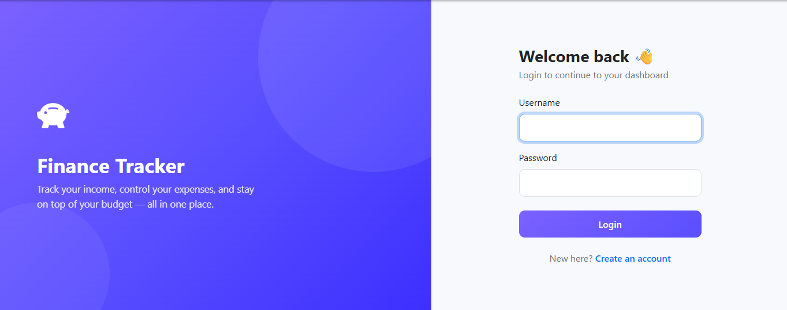
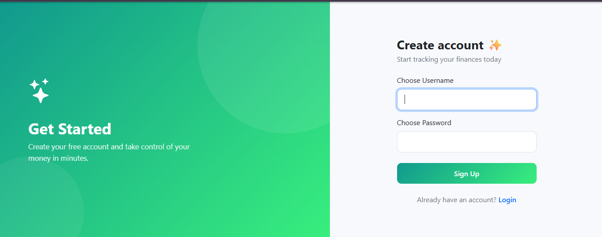
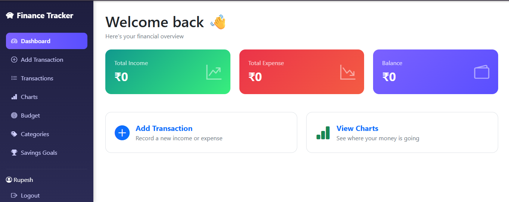
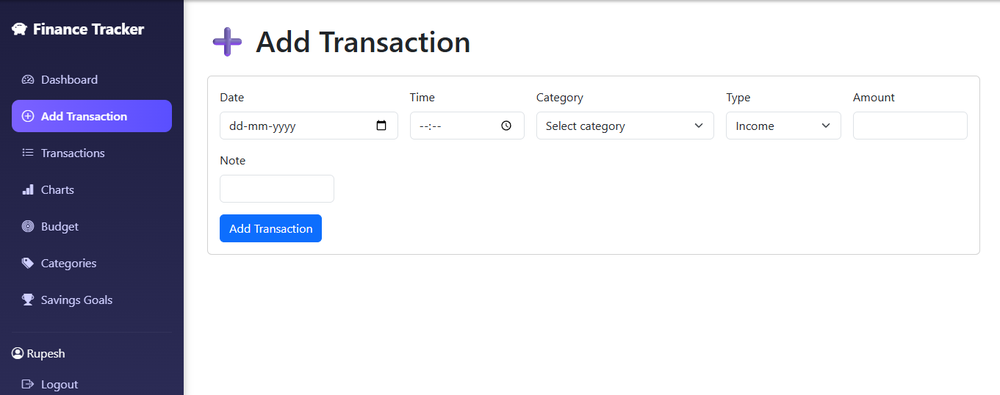
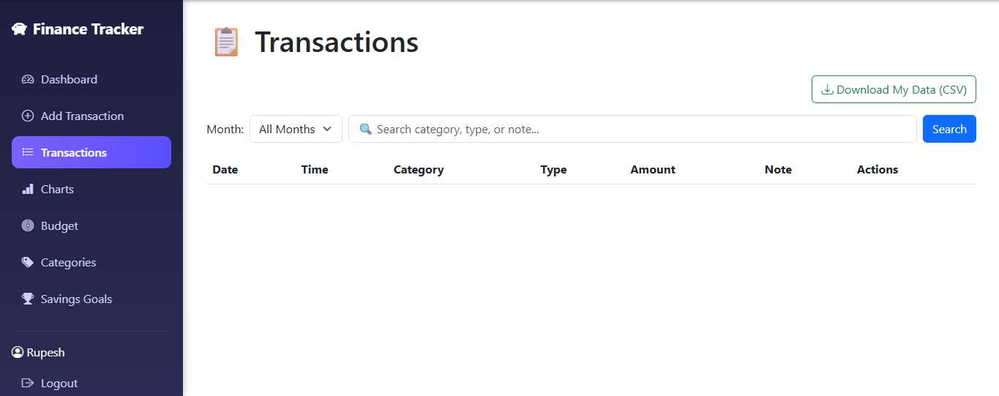
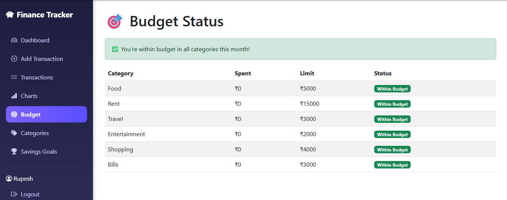
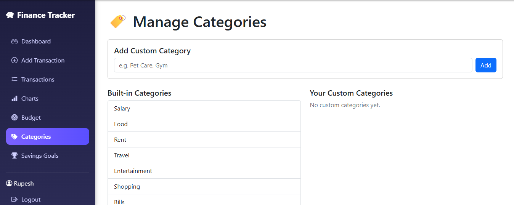
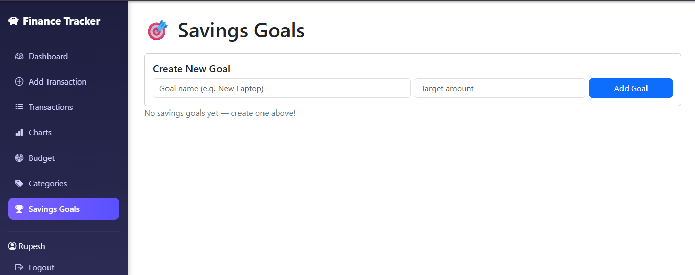

# 💰 Personal Finance Tracker

A modern **Flask-based Personal Finance Tracker** that helps users manage their finances efficiently. The application allows users to securely record income and expenses, monitor budgets, track savings goals, visualize financial data, and download transaction history.

---

## 📸 Project Preview

### 🔐 Login Page


### 📝 Signup Page


### 📊 Dashboard


### ➕ Add Transaction


### 📋 Transactions


### 🎯 Budget Tracking


### 🏷️ Categories


### 🎯 Savings Goals


---

# ✨ Features

- 🔐 Secure User Authentication (Signup/Login)
- 👤 Session-based Authentication
- 📊 Financial Dashboard
- 💰 Income & Expense Management
- ➕ Add Transactions
- ✏️ Edit Transactions
- ❌ Delete Transactions
- 📅 Monthly Transaction Filter
- 🔍 Search Transactions
- 📈 Expense Pie Chart
- 📉 Income vs Expense Bar Chart
- 💸 Budget Monitoring
- ⚠️ Budget Alerts
- 🏷️ Custom Categories
- 🎯 Savings Goals Tracking
- 📥 Download Transactions as CSV
- 👥 Multi-user Support
- 📱 Responsive User Interface

---

# 🛠️ Tech Stack

## Frontend
- HTML5
- CSS3
- JavaScript
- Bootstrap

## Backend
- Python
- Flask

## Libraries
- Pandas
- Matplotlib
- Werkzeug

## Data Storage
- CSV Files

---

# 📂 Project Structure

```
Personal_Finance_Tracker/
│
├── app.py
├── requirements.txt
├── README.md
├── data/
├── static/
└── templates/
```

---

# 🚀 Installation

### Clone the repository

```bash
git clone https://github.com/your-username/Personal-Finance-Tracker.git
```

### Go to project folder

```bash
cd Personal-Finance-Tracker
```

### Create Virtual Environment

```bash
python -m venv venv
```

### Activate Virtual Environment

Windows

```bash
venv\Scripts\activate
```

Linux / Mac

```bash
source venv/bin/activate
```

### Install Dependencies

```bash
pip install -r requirements.txt
```

### Run the Project

```bash
python app.py
```

Open your browser and visit

```
http://127.0.0.1:5000/
```

---

# 📊 Modules

### 🔐 Authentication

- User Signup
- User Login
- Logout
- Password Hashing

### 💰 Transaction Management

- Add Income
- Add Expense
- Edit Transaction
- Delete Transaction
- Search Transactions
- Monthly Filtering

### 📈 Dashboard

- Total Income
- Total Expense
- Current Balance

### 📊 Charts

- Expense Distribution (Pie Chart)
- Income vs Expense (Bar Chart)

### 💸 Budget

- Budget Limits
- Budget Alerts
- Category-wise Spending

### 🎯 Savings Goals

- Create Goal
- Add Savings
- Delete Goal

### 🏷️ Categories

- Built-in Categories
- Custom Categories

---

# 📌 Future Enhancements

- 🗄️ SQLite / PostgreSQL Integration
- 📄 Export Reports as PDF
- 🌙 Dark Mode
- 📱 Enhanced Mobile Responsiveness
- 📈 Advanced Analytics Dashboard
- 🤖 AI-Based Expense Prediction
- 🔔 Email Notifications
- ☁️ Cloud Database Support

---

# 🤝 Contributing

Contributions are welcome!

1. Fork the repository
2. Create your feature branch
3. Commit your changes
4. Push to the branch
5. Create a Pull Request

---

# 👩‍💻 Author

**Arpita Tandon**

🎓 MCA (Data Science)

💼 Full Stack Developer | Aspiring Data Scientist

GitHub: https://github.com/Predictive-Pioneers

LinkedIn: https://www.linkedin.com/in/arpita-tandon-31b3b7267/
---

# ⭐ Support

If you found this project useful, please consider giving it a ⭐ on GitHub.

It motivates me to build more exciting projects.

---

## 📄 License

This project is created for educational and portfolio purposes.